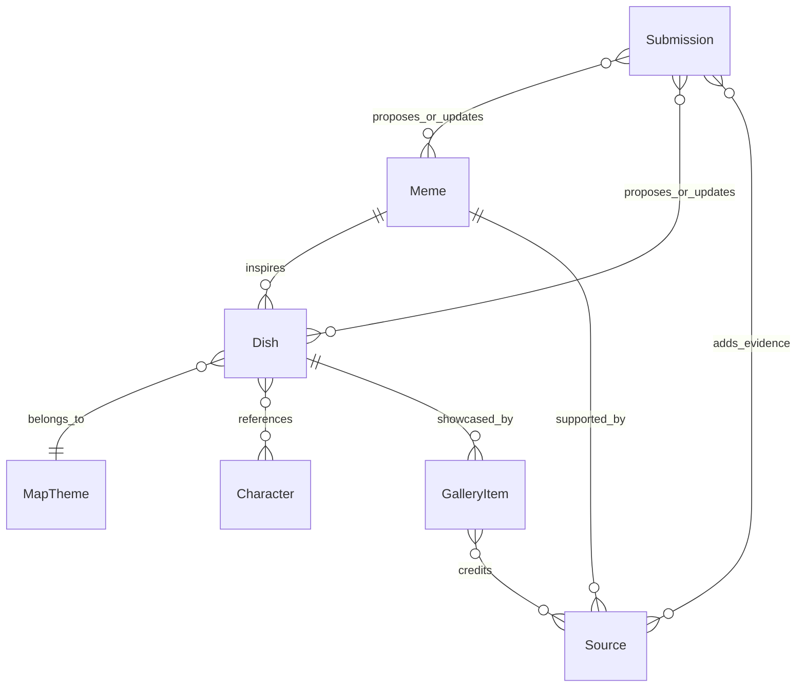

# 领域模型

本文档描述 NARAKA Restaurant 的核心内容模型。它用于指导后续 Astro 内容集合、Markdown frontmatter、页面模板和投稿审核。

## 总览

## Meme / 梗

**定义**：玩家社区中产生并传播的表达、桥段、称呼、二创设定或事件引用。

**建议字段**：

- `id`：稳定标识，例如 `soy-milk-noodle`。
- `title`：梗名称。
- `status`：来源核验状态，`verified`、`pending`、`mixed`、`rejected`。
- `publishStatus`：发布控制状态，`draft`、`published`、`needs-review`。
- `summary`：一句话解释。
- `originNote`：来源说明；未确认时写“待考证”。
- `sourceIds`：关联 Source。
- `relatedCharacterIds`：关联 Character。
- `tags`：用于筛选。

**规则**：

- 不能无来源写成事实。
- 来源不足时必须标为 `pending` 或 `mixed`，页面展示“待考证”或“资料整理中”。
- 示例：“豆浆烩面（待考证）”只能作为待考证示例，直到补齐来源。

## Dish / 菜品

**定义**：把一个或多个 Meme 包装成虚拟餐厅菜单项后的内容实体。

**建议字段**：

- `id`：稳定标识。
- `name`：菜品名。
- `subtitle`：短副标题。
- `mapThemeId`：所属 MapTheme。
- `memeIds`：关联 Meme。
- `characterIds`：关联 Character。
- `description`：餐厅菜单风格介绍。
- `lore`：梗解释和衍生文案。
- `sourceStatus`：`verified`、`pending`、`mixed`。
- `publishStatus`：`draft`、`published`、`needs-review`。
- `curator`：整理者或维护者署名。
- `spiceLevel`：可选展示字段。
- `priceLabel`：虚拟价格，只作玩梗展示。
- `galleryItemIds`：关联 GalleryItem。

**规则**：

- 菜品不是商品，不得出现真实购买、下单、支付承诺。
- 菜品文案可以有餐厅感，但要避免误导为真实营业。
- 一个 Dish 可以关联多个 Meme，但第一版应避免过度复杂。

## MapTheme / 地图主题

**定义**：用于组织视觉氛围、菜单分区和内容入口的场景主题。

**建议字段**：

- `key`：例如 `juku`、`huoluo`、`longyin`，用于 CSS 主题和代码引用。
- `name`：中文名称，例如聚窟洲、火罗国、龙隐洞天。
- `description`：主题氛围说明。
- `accentColor`：主题辅助色。
- `heroImage`：可选原创或授权图片。
- `dishIds`：关联 Dish。

**规则**：

- 这些主题是网站组织方式和视觉分区，不代表官方资料库。
- 统一写“龙隐洞天”，不要写成“龙影洞天”。
- 除非来源确认，不要把具体梗、地名解释或社区说法写成官方设定。

## Character / 角色

**定义**：与 Meme、Dish、GalleryItem 或 Submission 相关的游戏角色、社区称呼或角色化对象。

**建议字段**：

- `id`：稳定标识。
- `name`：展示名称。
- `type`：`official-character`、`community-alias`、`other`。
- `sourceIds`：名称或关联梗的来源。
- `note`：维护者备注。

**规则**：

- 具体角色名应来自官方资料或可靠来源。
- 不记录现实玩家隐私，不把个人身份写入 Character。

## Source / 来源

来源不再只是 URL，而是“证据条目”。每条来源必须能回答：它具体支撑页面中的哪些说法，以及不能支撑哪些外推结论。

必备字段：

- `title`：来源标题。
- `url`：公开链接；如果没有公开链接，必须使用 `noPublicLinkReason` 说明原因。
- `platform`：来源平台。
- `sourceType`：`official` / `guide` / `community` / `video` / `forum` / `unknown`。
- `supports`：该来源具体支撑的说法列表。
- `reliability`：`high` / `medium` / `low`。
- `checkedAt`：最近核查日期，格式 `YYYY-MM-DD`。
- `notes`：来源限制、不能证明的内容、版权或引用备注。

规则：

- 官方来源只支撑官方术语和官方说明，不自动支撑玩家梗称呼、菜品命名或社区共识。
- 社区来源只能支撑社区语境线索，不能单独证明官方机制细节。
- 菜品名、吐槽、口味、摆盘若为本站原创，必须标注为本站二创或本站菜品化命名。
- 如果来源不能支撑页面说法，必须改写、标注待考证，或降低 `status` / `publishStatus`。

**定义**：支撑 Meme、Dish、GalleryItem 或 Submission 的证据记录。

**建议字段**：

- `id`：稳定标识。
- `type`：`video`、`post`、`image`、`submission`、`maintainer-note`。
- `title`：来源标题。
- `url`：公开链接；没有公开链接时说明原因。
- `author`：作者或发布者。
- `platform`：平台。
- `publishedAt`：发布时间，未知时留空并说明。
- `capturedAt`：维护者记录时间。
- `reliability`：`primary`、`secondary`、`unclear`。
- `note`：考证说明。

**规则**：

- 优先使用一手来源。
- 二手转述只能作为线索，不应单独支撑“已核验”状态。
- 需要尊重平台规则和作者授权。

## Submission / 投稿

**定义**：社区成员提交的新梗、新菜品、来源补充、画廊作品或修正请求。

**建议字段**：

- `id`：GitHub Issue 或 PR 编号。
- `submitter`：GitHub 用户名或投稿署名。
- `type`：`new-meme`、`new-dish`、`source-update`、`gallery-item`、`correction`、`takedown`。
- `status`：`received`、`needs-source`、`needs-permission`、`accepted`、`rejected`。
- `relatedIds`：关联的 Meme、Dish、Source 或 GalleryItem。
- `reviewNote`：维护者审核记录。

**规则**：

- 投稿不等于发布，必须审核后进入正式内容。
- 画廊投稿必须确认授权。
- 删除或撤稿请求应优先处理。

## GalleryItem / 画廊作品

**定义**：社区授权展示的图片、菜单设计、短文、海报或其他同好作品。

**建议字段**：

- `id`：稳定标识。
- `title`：作品标题。
- `type`：`image`、`poster`、`menu-design`、`text`、`other`。
- `author`：作者署名。
- `licenseNote`：授权说明。
- `sourceIds`：来源和授权记录。
- `relatedDishIds`：关联 Dish。
- `relatedMemeIds`：关联 Meme。
- `assetPath`：本地资源路径；只允许原创或授权资源。
- `description`：作品说明。

**规则**：

- 未授权作品不得入库。
- 作者署名和来源链接必须在页面可见。
- 如果作者或权利人要求删除，应下架并记录处理。

## 关键关系

- 一个 Meme 可以启发多个 Dish。
- 一个 Dish 至少属于一个 MapTheme。
- 一个 Dish 可以关联多个 Character，但 Character 不是必须项。
- 一个 Source 可以支撑多个 Meme 或 GalleryItem。
- 一个 Submission 可以新增内容，也可以修正或删除内容。
- GalleryItem 必须有 Source 或授权记录。
